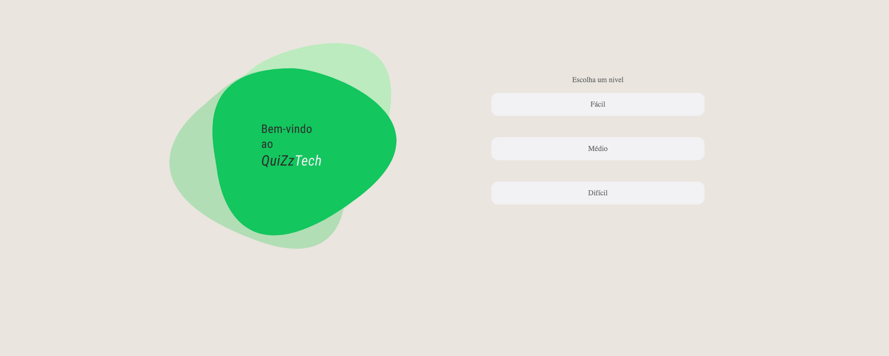

</img>

<h4 align="center"><a href="https://pedrocslucas.github.io/quizz-tech-site/">Clique para visitar o projeto</a></h4>

# quizz-tech-site
Quiz de tecnologia, feito em ReactJS e Bootstrap e com Licença Creative Commons, feito para obtenção da nota 2 da disciplina de Informática na Educação.

##LICENSE CC-BY

 This work is licensed under a <a rel="license" href="http://creativecommons.org/licenses/by/4.0/">Creative Commons Attribution 4.0 International License</a>.
